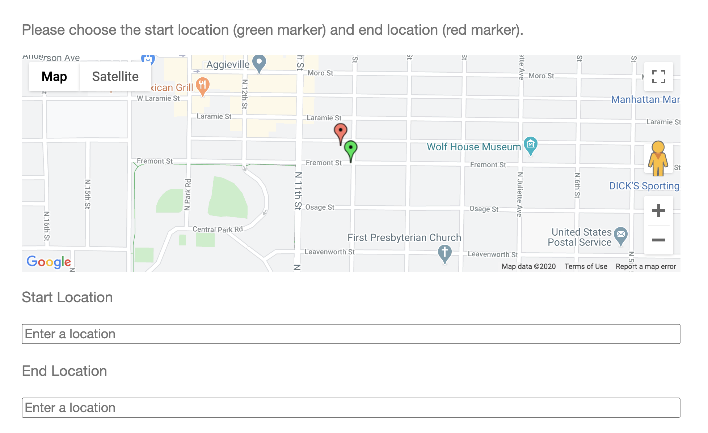

# Qualtrics Google Map

Embed a customizable Google Map in your Qualtrics survey to collect location data



## Prerequisites

### Qualtrics

Unfortunately Qualtrics does not allow adding JavaScript to questions on free accounts. In order to use Google Maps in your question, you must have a full account. See _[Trial Accounts](https://www.qualtrics.com/support/survey-platform/managing-your-account/trial-accounts/)_ on Qualtrics' support site for more information.

### Google Maps

You must have a valid Google Maps JavaScript API key. If you want to use the autocomplete functionality, the API key must have access to the Places API as well. See _[Get Maps JavaScript API Key](https://developers.google.com/maps/documentation/javascript/get-api-key)_ and _[Get Places API Key](https://developers.google.com/places/web-service/get-api-key)_ on Google's developer documentation.

## Getting Started

### Header Script

The first step is to add the Google Maps API and this script to your survey's header. See _[Adding a Survey Header/Footer](https://www.qualtrics.com/support/survey-platform/survey-module/look-feel/general-look-feel-settings/#AddFooterHeader)_ on Qualtrics' support site. When you get to the Rich Text Editor, click the  icon in the toolbar to display HTML. Paste the following at the top of the header:

```html
<script src="https://maps.googleapis.com/maps/api/js?libraries=places&key={YOURKEYHERE}"></script>
<script src="https://unpkg.com/qualtrics-google-map-lat-long@2.0.0/dist/QualtricsGoogleMap.min.js"></script>
```

Make sure to replace the `{YOURKEYHERE}` with your Google Maps API key.

### Adding a Map Question

Once you have the Header Script added, you can create map questions. Start by making a new _Text Entry_ question. Ensure that the text type used is single line. You can treat this question like you would any other (ex. require a response, change the title, etc.). It is recommended that you provide clear instructions to the responder in the question.

On the left side of the question, click the gear and select _Add JavaScript..._

Copy the code from the example below and modify the options to adjust how the map will render. Paste this below the `/*Place your JavaScript here to run when the page loads*/` text in the _addOnload_ section of the _Edit Question JavaScript_ dialog.

See _[Add JavaScript](https://www.qualtrics.com/support/survey-platform/survey-module/question-options/add-javascript/)_ on Qualtrics' support site for more information.

#### Option Documentation

- Map Options are documented on Google's developer documentation. [Center and zoom options are required](https://developers.google.com/maps/documentation/javascript/overview#MapOptions), and there are [many other options you can configure](https://developers.google.com/maps/documentation/javascript/reference/map#MapOptions).
- [Marker Options are documented on Google's developer documentation](https://developers.google.com/maps/documentation/javascript/reference/marker#MarkerOptions)
- Marker Autocomplete Options
  - You can enable an autocomplete field to assist responders in finding a location. Responders can enter a location into this field and the map will snap its marker to that location. They can then fine-tune the response by dragging the marker to a specific location (such as a door to a building).
  - See the example markers below
- If there is only one marker, you can click on the map to set its location.

#### Example

```js
initGoogleMapsQuestion(this.questionId, this.getQuestionContainer(), {
  // Map Options, set these! See Map Options in Option Documentation Section
  options: {
    center: {
      lat: 39.1836,
      lng: -96.5717,
    },
    zoom: 16,
  },
  // Marker Options, set these!
  markers: [
    // First Marker
    {
      // See Marker Options in Option Documentation Section
      options: {
        title: "Marker 1",
        draggable: true,
        label: "1",
      },
      autocomplete: {
        // If true, an autocomplete will show.
        enabled: true,
        // The label shown for the autocomplete field
        label: "Location for Marker 1",
        // Styles for the label
        labelCss: "padding-left: 0; padding-right: 0;",
        // Text to show if an invalid location is selected
        invalidLocationAlertText:
          "Please choose a location from the search dropdown. If your location doesn't appear in the search, enter a nearby location and move the marker to the correct location.",
      },
    },
    // Second Marker
    {
      // See Marker Options in Option Documentation Section
      options: {
        title: "This is an example second marker. Rename or delete me.",
        draggable: true,
        position: {
          lat: 39.184,
          lng: -96.572,
        },
        label: "2",
      },
      autocomplete: {
        // If true, an autocomplete will show.
        enabled: true,
        // The label shown for the autocomplete field
        label: "Location for Marker 2",
        // Styles for the label
        labelCss: "padding-left: 0; padding-right: 0;",
        // Text to show if an invalid location is selected
        invalidLocationAlertText:
          "Please choose a location from the search dropdown. If your location doesn't appear in the search, enter a nearby location and move the marker to the correct location.",
      },
    },
    // You can add more markers as well
  ],
});
```

Click Save. Test the question before sending out the survey. If you have any issues, see _Troubleshooting_ below.

## Data Collected

The result is collected in the Qualtrics question field as a string representation of a JSON object. Each marker is represented by its index as the key in the object and the latitude and longitude as the value.

### Example Single-Marker Question Data

`{0:{"lat":38.8951,"long":-77.0364}}`

### Example Multi-Marker Question Data

`{0:{"lat":38.8951,"long":-77.0364},1:{"lat":38.8951,"long":-77.0364},2:{"lat":38.8951,"long":-77.0364}}`

## Troubleshooting

### The map doesn't show after adding it to the question

The map will only show up in the actual survey, not in the back-end of Qualtrics. Try to preview or take the survey.

### The map or autocomplete field search shows "_This page can't load Google Maps correctly_" or "_For development purposes only_"

This usually indicates an issue with your API key. Make sure you set the API key in the Google Maps script placed in the header. Check that the API key has access to both the Maps JavaScript API, and if you are using the Autocomplete Field, the Places API. If you are still having trouble, follow [Google's API key troubleshooting steps](https://developers.google.com/maps/documentation/javascript/error-messages).

### Responses are not saving

Ensure that the text type used on your form is single line. [See Issue #6](https://github.com/pkmnct/qualtrics-google-map-lat-long/issues/6).

### I'm still having problems

Make sure you are using the latest version of the code. If that doesn't help, see if an [issue](https://github.com/pkmnct/qualtrics-google-map-lat-long/issues) has been created for the problem you are facing already. If not, you can [create a new issue](https://github.com/pkmnct/qualtrics-google-map-lat-long/issues).

## Migrating from 1.x

If you have used older versions of this script in your survey, you have a few options to migrate. Version 2.0 changes the way the data is stored in the text field to support multiple map markers. If you have started collecting survey responses, it may be beneficial for all of the data collected to be in the same format. If that is the case, follow the _I have already collected survey responses_ section below. If you do not mind the survey results mixing data types, or have not started collecting data, see the _I have not started collecting survey responses_ section below.

### I have already collected survey responses

In this case, it is recommended that you continue using [the older version of the script](https://github.com/pkmnct/qualtrics-google-map-lat-long/blob/4e9ab1288e6a030431b0e9eab6db56ba5b5062a2/README.md). This will ensure that all of the data collected is in the same format. If you do not mind the survey results mixing data types, see the _I have not started collecting survey responses_ section below.

### I have not started collecting survey responses

In this case, it is recommended that you update all older questions to use the new script. You can also mix 1.x and 2.x questions, but you must remove the code that loads the Google Maps API in all 1.x questions. This is the last code block pasted, below the _Load the Google Maps API if it is not already loaded_ comment. If you do not want to update questions, you can still use [the older version of the script](https://github.com/pkmnct/qualtrics-google-map-lat-long/blob/4e9ab1288e6a030431b0e9eab6db56ba5b5062a2/README.md).
